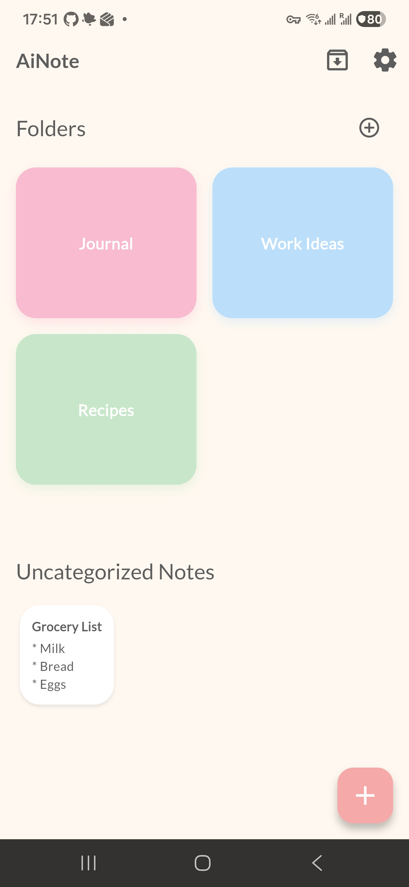

# Welcome to AiNote! 💖 Your new best friend for note-taking!

---

## English

Tired of boring note apps? **AiNote** is here to add a splash of color and a dash of fun to your daily notes! Built with love and Flutter, it's designed to be as delightful as it is functional.

### Features That Will Make You Smile 😊

*   **📝 A Magical Editor**: Jot down your brilliant ideas in our super-friendly editor.
*   **📂 Colorful Folders**: Organize your thoughts into adorable, color-coded folders. Who said organizing can't be fun?
*   **✍️ Speedy Prompts**: Got things you type all the time? Set up 3 custom prompts and voilà, instant text!
*   **🗄️ Tidy-Up Time**: Send notes to the archive to keep your main space sparkling clean.
*   **🎨 Pretty & Polished**: A stunning interface that looks gorgeous on any device.
*   **🌙 Day & Night Modes**: Whether you're a sunshine-lover or a night owl, we've got a theme for you.

### How to Play (Local Development) 🪄

1.  Get your Flutter wand ready! ([Install Flutter](https://flutter.dev/docs/get-started/install))
2.  Clone this magical castle (`git clone ...`).
3.  Cast the `flutter pub get` spell to gather all the magic ingredients.
4.  And... `flutter run` to bring it to life!

---

## 中文

欢迎来到 **AiNote**！💖 你的全新笔记小闺蜜！

### AiNote - 您的智能笔记伴侣

厌倦了那些枯燥无味的笔记应用？**AiNote** 来啦！它为你的日常笔记增添一抹色彩和一丝乐趣！我们用爱和 Flutter 精心打造，既可爱又实用。

### 让你微笑的功能 😊

*   **📝 魔法编辑器**: 在我们超友好的编辑器里，轻松记下你的奇思妙想。
*   **📂 彩色文件夹**: 把你的想法放进可爱的彩色文件夹里。谁说整理不能充满乐趣？
*   **✍️ 快捷小纸条**: 有没有一些话你总是重复输入？设置 3 个自定义提示，一键发送，简直不要太方便！
*   **🗄️ 整理时间到**: 把笔记归档，让你的主屏幕随时保持清爽闪亮。
*   **🎨 颜值即正义**: 精致的界面，在任何设备上都美美哒。
*   **🌙 白天与黑夜**: 无论你是阳光爱好者还是夜猫子，总有一款主题适合你。

### 如何施展魔法 (本地开发) 🪄

1.  准备好你的 Flutter 魔法棒！([安装 Flutter](https://flutter.dev/docs/get-started/install))
2.  克隆这座魔法城堡 (`git clone ...`)。
3.  念出咒语 `flutter pub get` 来收集所有魔法原料。
4.  然后... `flutter run`，让它活起来！

